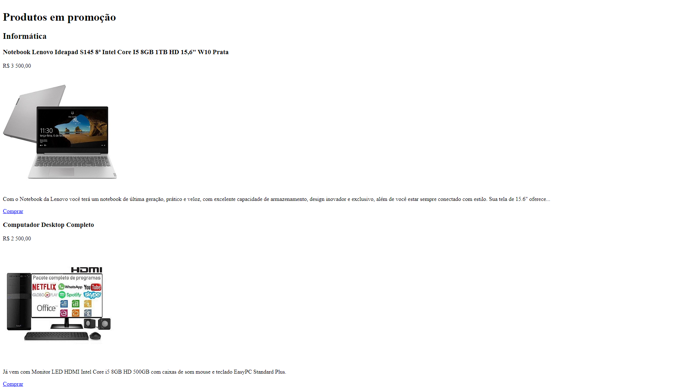

<h1>Projeto: Loja Virtual de Informática</h1>

Exercício realizado como atividade prática na Plataforma DevMedia. O projeto foi realizado com o propósito de construir um documento em HTML.

<h2>Objetivos do exercício</h2>

Primeiro contato com HTML utilizando VS Code.

<ul>
  <li>A proposta desse projeto é criar um site sem estilização utilizando a tecnologia HTML.</li>
  <li>Teremos apenas um único arquivo HTML que conterá informações sobre um parque.</li>
  <li>Ao criar o arquivo HTML desse projeto, você vai poder colocar em prática o seguinte conceito:
* Utilizar tags HTML (básicas)</li>
</ul>

Nesta missão nosso foco é posicionar e exibir elementos HTML, por isso não vamos nos preocupar com a estética, ou seja, em criar estilos CSS.

<h2>Tecnologias Utilizadas</h2>
<ul>
  <li>HTML: A estrutura do site foi desenvolvida usando HTML (Hypertext Markup Language), proporcionando uma base sólida para a construção do conteúdo da página.</li>
</ul>

<h2>Minhas considerações</h2>

A cada dia um degrau, a cada passo uma nova experiencia, a cada momento mais um desafio. 
Não podemos parar, todo aprendizado tem seus frutos.
Aos poucos a gente vai alcançando o objetivo, ainda tenho muito que aprender. 
Fico grato por tudo até aqui, pois ainda tem mais pra acontecer!

<h2>Como Contribuir</h2>

Se você gostaria de contribuir para este projeto, sinta-se à vontade para abrir problemas (issues) ou enviar pull requests com melhorias ou correções. Suas contribuições são bem-vindas!

<h2>Contato</h2>

Se você tiver alguma dúvida, sugestão ou feedback, fique à vontade para entrar em contato comigo.
 
Espero que esta estrutura básica ajude você a criar o seu README. Sinta-se à vontade para personalizá-lo e adicionar informações adicionais que sejam relevantes para os seus exercícios. 
Continue acompanhando minha evolução! 
Deixe suas dicas, melhorias, opniões e incentivos. 
 
Entre com contato: 

