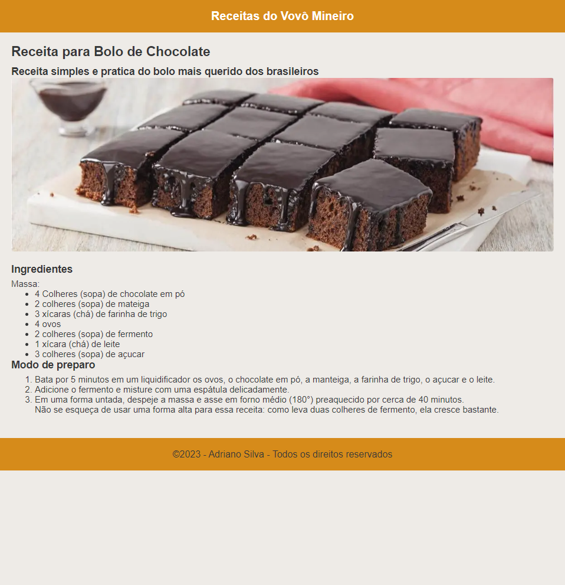

<h1>Projeto: Receitas do Vovô Mineiro</h1>

Exercício realizado como atividade prática na Plataforma DevMedia. O projeto foi realizado utilizando o metódo de camadas.

<h2>Objetivos do exercício</h2>

Metodo de camadas.

<ul type="1">
  <li>Camada: Criar a estrutura de pastas e o arquivo HTML.</li>
  <li>Camada: Criar o código HTML da página.</li>
  <li>Camada: Criar o código CSS da página; Arquivo CSS e link com arquivo HTML; Estilizando a página com código CSS.</li>
</ul>

<h2>Tecnologias Utilizadas</h2>
<ul>
  <li>HTML: A estrutura do site foi desenvolvida usando HTML (Hypertext Markup Language), proporcionando uma base sólida para a construção do conteúdo da página.</li>
  <li>CSS: O estilo visual do site foi estilizado usando CSS (Cascading Style Sheets). Foram aplicadas técnicas avançadas de CSS, como flexbox para layouts flexíveis e responsivos, e efeitos como transições e transformações para criar uma experiência de usuário agradável.</li>
</ul>

<h2>Minhas considerações</h2>

Neste exercicio pude praticar os conteudos até aqui aprendidos e coloca-los em pratica.

<h3>Durante o curso eu aprendi:</h3>
<ul>
  <li>O que é CSS</li>
  <li>A sintaxe do código CSS</li>
  <li>Propriedades de texto e de cor</li>
  <li>Criar e estilizar uma página web</li>
</ul>

<h2>Como Contribuir</h2>

Se você gostaria de contribuir para este projeto, sinta-se à vontade para abrir problemas (issues) ou enviar pull requests com melhorias ou correções. Suas contribuições são bem-vindas!

<h2>Contato</h2>

Se você tiver alguma dúvida, sugestão ou feedback, fique à vontade para entrar em contato comigo.
 
Espero que esta estrutura básica ajude você a criar o seu README. Sinta-se à vontade para personalizá-lo e adicionar informações adicionais que sejam relevantes para os seus exercícios. 
Continue acompanhando minha evolução! 
Deixe suas dicas, melhorias, opniões e incentivos. 
 
Entre com contato: 

