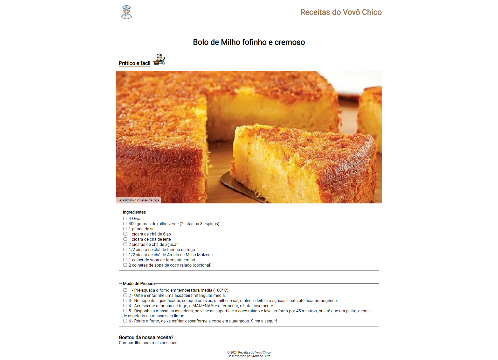

<h1>Projeto: Site receitas do Vovô Chico</h1>

Este é o repositório para uma pagina de receitas de um site ficticio por nome Receitas do Vovô Chico. Exercicio prático realizado depois das aulas realizadas na Plataforma DevMedia. O projeto apresenta uma pagina responsiva construída com tecnologias web padrão, HTML e CSS.

<h2>Objetivos do exercício</h2>
<h2>Este exercicio foi realizado utilizando metodos de camada.</h2>

        1ª Camada: Criar a estrutura de pastas e o arquivo HTML. 
        2ª Camada: Criar o código HTML da página. 
        3ª Camada: Criar o código CSS da página. 
    Observação: respeitada semantica HTML e CSS com suas classes e responsividade.

<h2>Tecnologias Utilizadas</h2>
<ul>
  <li>HTML (básicas): A estrutura do site foi desenvolvida usando HTML (Hypertext Markup Language), proporcionando uma base sólida para a construção do conteúdo da página.</li>
  <li>CSS: O estilo visual do site foi estilizado usando CSS (Cascading Style Sheets). Foram aplicadas técnicas avançadas de CSS, como flexbox para layouts flexíveis e responsivos, e efeitos como transições e transformações para criar uma experiência de usuário agradável.</li>
</ul>

<h2>Minhas considerações</h2>

Realizadas mudanças em toda parte visual para uma melhro experiencia do usuario com opção de marcacao dos itens que forem utilizados para melhor acompanhamento da receita.

<h2>Como Contribuir</h2>

Se você gostaria de contribuir para este projeto, sinta-se à vontade para abrir problemas (issues) ou enviar pull requests com melhorias ou correções. Suas contribuições são bem-vindas!

<h2>Contato</h2>

Se você tiver alguma dúvida, sugestão ou feedback, fique à vontade para entrar em contato comigo.
 
Espero que esta estrutura básica ajude você a criar o seu README. Sinta-se à vontade para personalizá-lo e adicionar informações adicionais que sejam relevantes para os seus exercícios. 
Continue acompanhando minha evolução! 
Deixe suas dicas, melhorias, opniões e incentivos. 
 

Entre com contato: 

