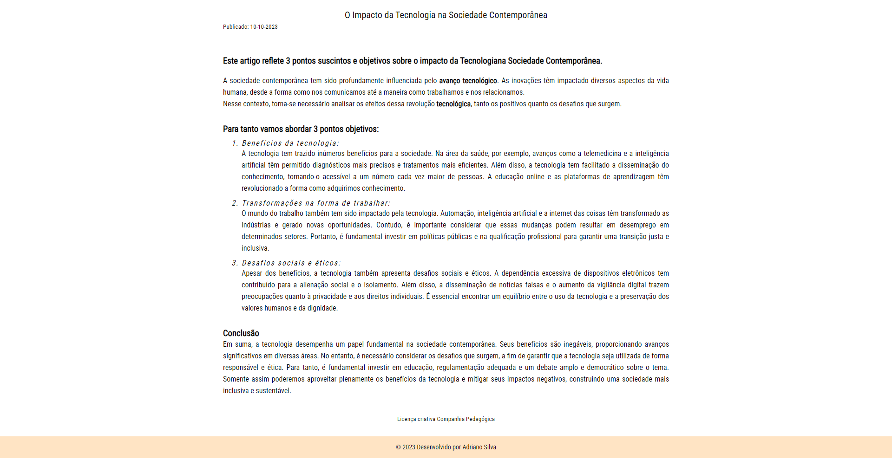

<h1>Projeto: Artigo O Impacto da Tecnologia na Sociedade Contemporânea</h1>

Companhia Pedagógica (Fictícia)

<h2>Objetivos do exercício</h2>

Praticando CSS - Propriedades 
Neste exercicio pude praticar os conteudos até aqui aprendidos e colocá-los em prática.  

<h3>Como por exemplo:</h3>
<ul>
  <li>font-size</li>
  <li>font-family</li>
  <li>font-weight</li>
  <li>span</li>
  <li>text-decoration</li>
  <li>font-style</li>
  <li>text-align</li>
  <li>line-height</li>
  <li>small</li>
  <li>strong</li>

</ul>

<h2>Tecnologias Utilizadas</h2>
<ul>
  <li>HTML (básicas): A estrutura do site foi desenvolvida usando HTML (Hypertext Markup Language), proporcionando uma base sólida para a construção do conteúdo da página.</li>
  <li>CSS: O estilo visual do site foi estilizado usando CSS (Cascading Style Sheets).</li>
</ul>

<h2>Minhas considerações</h2>

As fontes representam uma parte muito importante nas páginas web, visto que basicamente todos os sites possuem texto em suas páginas. Aprender a usar propriedades para fontes como font-size e font-family é fundamental para o desenvolvedor web deixar os textos com uma aparência mais apresentável.

<h2>Como Contribuir</h2>

Se você gostaria de contribuir para este projeto, sinta-se à vontade para abrir problemas (issues) ou enviar pull requests com melhorias ou correções. Suas contribuições são bem-vindas!

<h2>Contato</h2>

Se você tiver alguma dúvida, sugestão ou feedback, fique à vontade para entrar em contato comigo.
 
Espero que esta estrutura básica ajude você a criar o seu README. Sinta-se à vontade para personalizá-lo e adicionar informações adicionais que sejam relevantes para os seus exercícios. 
Continue acompanhando minha evolução! 
Deixe suas dicas, melhorias, opniões e incentivos. 
 

Entre com contato: 

