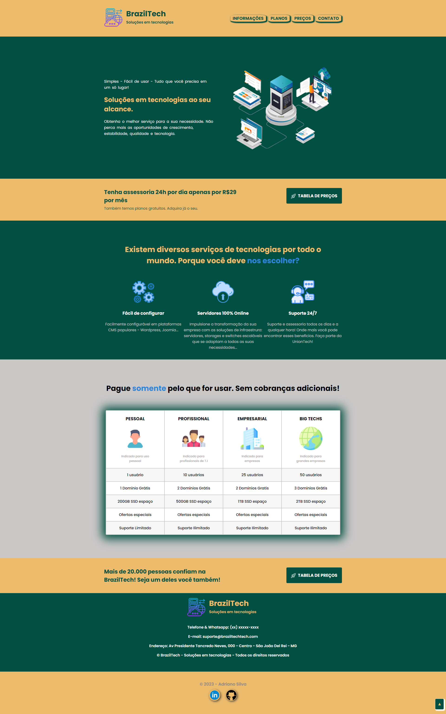
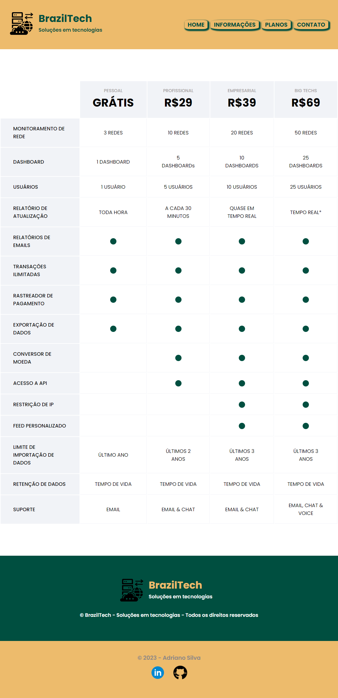

<h2>Exercício prático: Site de hospedagem e tecnologias</h2>

  <h3>Esse exercicio foi realizado com o proposito de construir um documento em HTML e CSS.</h3>
  
Foram aplicados a este site os conteúdos estudados até o momento de HTML e CSS como missão-6 na plataforma da DevMedia. A cada dia um degrau, a cada passo uma nova experiencia, a cada momento mais um desafio. 
Não podemos parar, todo aprendizado tem seus frutos.
Aos poucos a gente vai alcançando o objetivo, ainda tenho muito que aprender. 
Fico grato por tudo até aqui, pois ainda tem mais pra acontecer!

  <h3>Contato</h3>
  Se você tiver alguma dúvida, sugestão ou feedback, fique à vontade para entrar em contato comigo. 
   
  Espero que esta estrutura básica ajude você a criar o seu README. Sinta-se à vontade para personalizá-lo e adicionar informações adicionais que sejam relevantes para os seus exercícios. 
  Continue acompanhando minha evolução! 
  Deixe suas dicas, melhorias, opniões e incentivos. 
  
  

